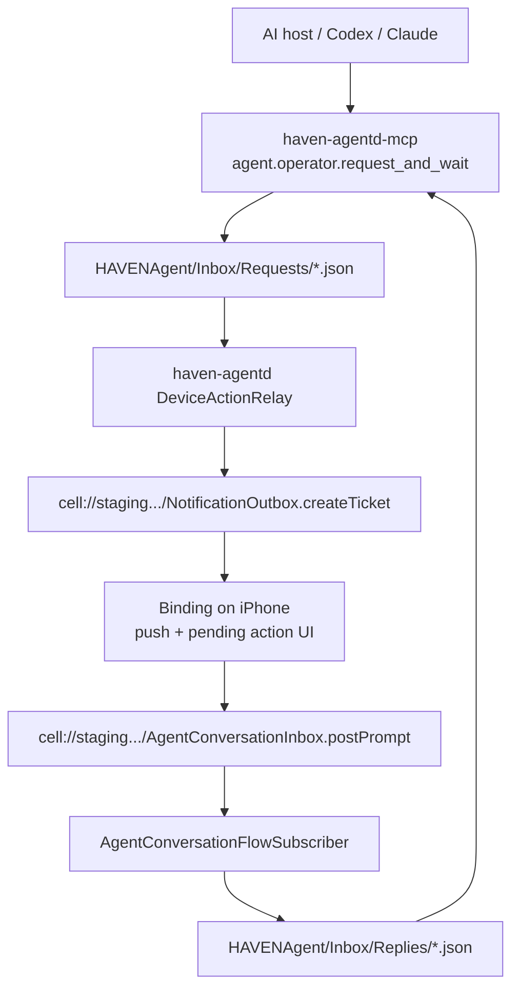

# HAVEN Agent Phone Approval Loop Runbook

This runbook documents the current iPhone notification / approval loop for `haven-agentd`, `haven-agentd-mcp`, and the `Binding` iOS app.

It is intentionally explicit about what is verified, what is inferred, and what is still blocked.

Related docs:

- [../HavenAgentD/Docs/HavenAgentDMCPServerSurface.md](../HavenAgentD/Docs/HavenAgentDMCPServerSurface.md)
- [../HavenAgentD/Docs/DeviceActionRelay.md](../HavenAgentD/Docs/DeviceActionRelay.md)
- [../HavenAgentD/Docs/OperatorRunbook.md](../HavenAgentD/Docs/OperatorRunbook.md)

## Goal

The target user flow is:

1. an AI coding host calls `agent.operator.request_and_wait` over MCP
2. `haven-agentd` publishes an operator request to the phone
3. the iPhone app shows an approval or prompt UI
4. the operator approves, rejects, or writes the next prompt
5. the reply lands back in `HAVENAgent/Inbox/Replies`
6. the MCP host resumes the job using that reply

## Architecture



## Code Surface

The flow currently spans these implementation points:

- MCP adapter tools in `HavenAgentD/Sources/HavenAgentDMCP/HavenAgentMCPService.swift`
  - `agent.operator.request`
  - `agent.operator.wait_for_reply`
  - `agent.operator.request_and_wait`
- relay request/reply plumbing in `HavenAgentD/Sources/HavenAgentRuntime/DeviceActionRelay.swift`
- reply correlation and `requestId` propagation in `HavenAgentD/Sources/HavenAgentRuntime/AgentConversationFlowSubscriber.swift`
- iPhone-side reply posting in `Binding/AgentConversationClient.swift`
- iPhone-side APNs registration and callback handling in:
  - `Binding/BindingAppNotifications.swift`
  - `Binding/NotificationEnrollmentManager.swift`
  - `Binding/NotificationCallbackClient.swift`
  - `Binding/PendingAgentActionView.swift`

## Verified Status As Of 2026-05-05

| Area | Status | Notes |
| --- | --- | --- |
| MCP server surface | Verified | `haven-agentd-mcp` exposes `agent.operator.request`, `agent.operator.wait_for_reply`, and `agent.operator.request_and_wait`. |
| MCP tests | Verified | `HavenAgentMCPServiceTests` and `AgentConversationFlowSubscriberTests` passed earlier in this session. |
| iOS generic build | Verified | `xcodebuild -quiet -workspace Binding.xcworkspace -scheme Binding -destination 'generic/platform=iOS' build CODE_SIGNING_ALLOWED=NO` succeeded. |
| Physical iPhone build | Verified | `xcodebuild ... -destination 'id=00008150-00050C200ED8401C' ... build` succeeded with signing. |
| Physical iPhone install | Verified | `xcodebuild ... install` succeeded on the connected phone. |
| CLI launch via `devicectl` | Blocked | `xcrun devicectl device process launch ...` timed out waiting for `CoreDeviceService`. |
| Existing installed agent config | Not ready | `jq 'has("deviceActionRelay")' ~/Library/Application Support/HAVENAgent/config.json` returned `false`. |
| Isolated relay-enabled smoke config | Verified locally | Separate config under `/tmp/haven-phone-smoke-config.json` validated and started. |
| Request folder monitoring | Verified | malformed and well-formed request files were picked up and moved out of `Inbox/Requests`. |
| Unsandboxed local control bridge | Verified | foreground smoke agent started with `Server started on http://127.0.0.1:43111`. |
| Live staging bootstrap for smoke agent | Blocked | `sprout bootstrap join` failed with `error: expired`. |
| Live NotificationOutbox publish | Reached server but failed | request `phone-smoke-004` ended with `There was a bad response from the server.` |
| End-to-end phone approve/reply/resume | Not yet verified | no confirmed push-to-reply roundtrip yet. |

## Update As Of 2026-05-14

The stale bootstrap blocker from 2026-05-05 was cleared for the local smoke path:

- `haven-agentd refresh-starter-auth --ttl-seconds 3600` generated a fresh signed starter auth valid until `2026-05-14T18:52:54Z`.
- `haven-agentd bootstrap-probe --run-bootstrap` succeeded for the live config earlier in the session.
- The isolated relay config at `/tmp/haven-phone-smoke-config.json` still validates and starts on `127.0.0.1:43111`.

The remaining live blocker is now narrower:

- request `phone-live-003` decoded successfully
- relay payload included the resolved device id in the nested `payload.deviceId` field when available, matching the current `NotificationOutboxCell` lookup contract
- publish still failed before `createTicket`, while resolving the remote cell:

```text
Device action relay publish failed: Could not resolve NotificationOutbox at cell://staging.haven.digipomps.org/NotificationOutbox: There was a bad response from the server.
```

Interpretation:

- the phone/APNS/prompt UI roundtrip is still unproven
- the failure is no longer explained by expired starter auth
- the failure appears to be in remote CellProtocol resolution, staging grant, or bridge transport for `cell://staging.haven.digipomps.org/NotificationOutbox`
- the request never reaches a structured `NotificationTicketRecord`

Related CellProtocolDocuments/CellScaffold work checked on 2026-05-14:

- `CellProtocolDocuments/Book/21_Contact_Endpoint_Cell.md` documents `ContactEndpointCell` as the protocol-native contact surface for other entity endpoints.
- `ContactEndpointCell` and `ContactRegistryCell` are implemented in CellScaffold.
- `swift test --package-path ../CellScaffold --filter ContactEndpointCellTests` passed 13 tests.
- `swift test --package-path ../CellScaffold --filter ContactRegistryCellTests` passed 5 tests.
- `PersonalCopilotV1Tests/testChatEntityExtensionScansOwnerScopedCapabilities` passed.
- live CellScaffold on port `9089` returned `200` for `GET /personal-copilot-v1/chat/api/entity-extension` and `POST /personal-copilot-v1/chat/api/entity-extension/scan`.

Binding follow-up completed on 2026-05-14:

- `BindingContactEndpointCell` now exposes the local owner-scoped
  `cell:///ContactEndpoint` contract used by the canonical entity endpoint
  route.
- `PersonalChatHub`/Co-Pilot Chat parity now has side-effect-free
  `entityExtension.scan` and ContactEndpoint resource matching for prompts about
  sending a message/request through another entity's endpoint cell.
- `xcodebuild test -project Binding.xcodeproj -scheme Binding -only-testing:BindingTests/ChatWorkbenchParityTests`
  passed 8 tests, including a signed `contact.request`, replay rejection,
  `ticket.resolve`, `ticket.respond`, and zero-side-effect chat scan/analyze.

That means the recommended future route for "send a message via another entity's endpoint cell" is `ContactEndpointCell.contact.request`, with `NotificationOutbox` only as wakeup adapter. The current Binding/HAVENAgentD phone smoke still uses `NotificationOutbox` directly.

## Update As Of 2026-05-15

CellScaffold staging is running the same revision as the local CellScaffold checkout used for this review:

- `GET https://staging.haven.digipomps.org/health` returned `{"status":"ok"}`.
- `GET https://staging.haven.digipomps.org/health/build` returned `app_revision=6077784e35f636b6a17cbc0d381bce0ced28fdff`, matching local `CellScaffold` `HEAD`.
- `POST https://staging.haven.digipomps.org/conference-mvp/api/device/register` with an empty JSON object returned a structured `400` for missing `participantId`, confirming the device registration route is mounted. No device token was sent during this probe.

The deployed CellScaffold code now has the real APNS-capable path:

- `DeviceRegistrationCell` is registered as `cell:///DeviceRegistration`, `identityUnique`, persistent, under the owner identity domain.
- `NotificationOutboxCell` is registered as `cell:///NotificationOutbox`, persistent, and resolves devices from `DeviceRegistrationCell` before sending push.
- `EnvironmentPushProviderAdapter` selects APNS for iOS when `APNS_TEAM_ID`, `APNS_KEY_ID`, `APNS_PRIVATE_KEY_P8` or `APNS_PRIVATE_KEY_BASE64`, and `APNS_BUNDLE_ID`/`APNS_TOPIC` are configured.
- `ContactEndpointCell` should still be the protocol-native entity endpoint; it uses `NotificationOutbox` only as a private wakeup adapter.

Binding privacy hardening completed in `NotificationEnrollmentManager`:

- APNS device tokens are no longer persisted in `UserDefaults`.
- Legacy `binding.notifications.apnsToken` is removed during bootstrap and after registration.
- The token is kept only in memory long enough to call the staging device registration API, then cleared after a successful registration.
- On iOS startup, Binding asks the OS to re-deliver the remote notification token when terms are accepted and notification permission is already granted.

Remaining live blockers / unknowns:

- Staging health does not expose whether APNS environment variables are configured, so real APNS delivery is still unproven.
- A full live roundtrip still needs a real APNS token from a signed iPhone build, or a simulator APNS sandbox token if the host/Xcode setup supports it and staging uses `APNS_USE_SANDBOX=true`.
- If staging APNS is configured for production while Binding is using a development/simulator entitlement, delivery will fail even though registration succeeds.

## Update As Of 2026-05-16

Binding APNS capability hardening:

- `Binding/Binding-iOS.entitlements` now includes `aps-environment=development`.
- The iOS and macOS keychain access group now expands from `$(PRODUCT_BUNDLE_IDENTIFIER)` instead of the older `com.digipomps.Binding` identifier.
- The Xcode target metadata now marks Push Notifications and Background Modes as enabled capabilities.
- `Info.plist` still includes `UIBackgroundModes.remote-notification`, which is the required background mode for silent/remote notification wakeups.

Local simulator proof:

- A fresh iOS simulator build succeeded.
- The generated simulator entitlement file includes:
  - `application-identifier=58VP3BNL4B.org.digipomps.Binding.dev`
  - `aps-environment=development`
  - `keychain-access-groups=58VP3BNL4B.org.digipomps.Binding.dev`
- `xcrun simctl push` delivered a HAVENAgent notification into the running Binding simulator app.
- A first payload showed the approve/reject pending-action card.
- A second payload using `requiredActionKey=haven.agent.followup.prompt` showed the next-prompt card with a text editor and disabled `Send prompt` button until input is entered.
- Screenshot artifacts:
  - `/private/tmp/binding-hard-push-after.png`
  - `/private/tmp/binding-hard-push-prompt.png`

Physical device blocker:

- `iKjetil17 Pro` is visible to Xcode as `00008150-00050C200ED8401C`.
- A signed physical device build now fails for the correct reason: the current personal development team provisioning profile for `org.digipomps.Binding.dev` does not support Push Notifications and does not include `aps-environment`.
- Even with `-allowProvisioningUpdates`, Xcode reports: personal development teams do not support the Push Notifications capability.

Required next external step:

- Use a paid Apple Developer Program team/App ID for `org.digipomps.Binding.dev`, enable Push Notifications on that App ID, regenerate/download the development provisioning profile, then rerun the physical device build.
- After that succeeds, the phone can obtain a real APNS token and Binding can register it with staging `DeviceRegistrationCell`.

## What Was Proven Today

### 1. The app can now be built for iPhone again

Two iOS-specific build blockers were fixed:

- `Cells/AgentEnrollmentCell.swift`
- `Cells/AgentProvisioningCell.swift`

The fixes were:

- avoid `FileManager.default.homeDirectoryForCurrentUser` on iOS
- provide a non-macOS stub for `runExternalLaunchAgentScript(...)`

That was enough to restore both:

- generic iOS builds
- signed device builds

### 2. The connected phone is a real install target

Earlier in this session, `xcodebuild -showdestinations` reported the connected iPhone:

- `iKjetil17 Pro`
- destination id `00008150-00050C200ED8401C`

The successful install used:

```bash
xcodebuild \
  -workspace Binding.xcworkspace \
  -scheme Binding \
  -destination 'id=00008150-00050C200ED8401C' \
  -configuration Debug \
  -derivedDataPath /tmp/BindingPhoneDevice \
  -allowProvisioningUpdates \
  install
```

Result:

```text
** INSTALL SUCCEEDED **
```

### 3. The current installed `HAVENAgent` runtime is not yet wired for the phone loop

The real config at:

```text
~/Library/Application Support/HAVENAgent/config.json
```

does not currently include `deviceActionRelay`.

This means the already-running installed agent is not yet configured to:

- watch `Inbox/Requests` for phone approvals
- publish those requests through `NotificationOutbox`
- subscribe to `AgentConversationInbox` replies back from the phone

### 4. A separate relay-enabled smoke agent can start safely

To avoid mutating the live installed config, a separate smoke config was created:

```text
/tmp/haven-phone-smoke-config.json
```

with:

- `instanceName = haven-agentd-phone-smoke`
- `localControlBridge.port = 43111`
- `deviceActionRelay.enabled = true`
- `deviceActionRelay.defaultParticipantID = binding-participant`

The config validated with:

```bash
HavenAgentD/.build/debug/haven-agentd validate-config \
  --config /tmp/haven-phone-smoke-config.json
```

Result:

```text
Config OK: /tmp/haven-phone-smoke-config.json
```

### 5. The smoke agent proves the relay code path is alive

The separate smoke agent created:

- `/tmp/haven-phone-smoke/HAVENAgent/Inbox/Requests`
- `/tmp/haven-phone-smoke/HAVENAgent/Inbox/Processed`
- `/tmp/haven-phone-smoke/HAVENAgent/Inbox/Failed`
- `/tmp/haven-phone-smoke/HAVENAgent/Inbox/Replies`

and wrote runtime state under:

- `/tmp/haven-phone-smoke/HAVENAgent/State/agent-state.json`
- `/tmp/haven-phone-smoke/HAVENAgent/State/cell-runtime.json`
- `/tmp/haven-phone-smoke/HAVENAgent/State/agent-identity.json`

That matters because it proves the request/reply filesystem surface is not hypothetical anymore.

### 6. The first failure was sandbox/network, not parsing

The first successful well-formed smoke request was:

- `phone-smoke-003`

It decoded correctly, and then failed with:

```text
Lightweight websocket connect timed out
```

That happened while the agent was running inside the normal sandbox.

After rerunning the same foreground smoke outside the sandbox, the control bridge came up cleanly:

```text
Server started on http://127.0.0.1:43111
```

This is strong evidence that the earlier timeout was environmental, not a local file-format or MCP bug.

### 7. The remaining live blocker is now staging/bootstrap freshness

The smoke agent's `agent-state.json` shows:

```text
error: expired
```

coming from:

```text
sprout bootstrap join ... --starter ~/Library/Application Support/HAVENAgent/starter-auth.json ...
```

The current starter auth file confirms that it is already expired:

```json
{
  "created_at": "2026-05-04T20:43:29Z",
  "expires_at": "2026-05-04T20:58:29Z"
}
```

Inference:

- this definitely explains why fresh bootstrap/join fails today
- it likely also contributes to the later `bad response from the server` seen when trying to publish a live phone approval ticket

The second point is an inference, not a direct proof.

## Commands Run Today

### Build and install

```bash
xcodebuild -quiet -workspace Binding.xcworkspace -scheme Binding -destination 'generic/platform=iOS' build CODE_SIGNING_ALLOWED=NO
xcodebuild -workspace Binding.xcworkspace -scheme Binding -destination 'id=00008150-00050C200ED8401C' -configuration Debug -derivedDataPath /tmp/BindingPhoneDevice -allowProvisioningUpdates build
xcodebuild -workspace Binding.xcworkspace -scheme Binding -destination 'id=00008150-00050C200ED8401C' -configuration Debug -derivedDataPath /tmp/BindingPhoneDevice -allowProvisioningUpdates install
```

Results:

- generic iOS build succeeded
- signed device build succeeded
- install to the connected phone succeeded

### Device launch attempts

```bash
xcrun devicectl device process launch --device 00008150-00050C200ED8401C com.digipomps.Binding
```

Result:

```text
ERROR: Timed out waiting for CoreDeviceService to fully initialize.
```

This blocked fully automated launch from the shell, even though Xcode-driven install succeeded.

### Isolated relay smoke

Config creation:

```bash
jq '. + {
  instanceName:"haven-agentd-phone-smoke",
  localControlBridge:(.localControlBridge + {port:43111}),
  deviceActionRelay:{
    enabled:true,
    notificationOutboxEndpoint:"cell://staging.haven.digipomps.org/NotificationOutbox",
    defaultParticipantID:"binding-participant",
    defaultTTLSeconds:900,
    conversationEndpoint:"cell://staging.haven.digipomps.org/AgentConversationInbox"
  }
}' ~/Library/Application\ Support/HAVENAgent/config.json > /tmp/haven-phone-smoke-config.json
```

Foreground run:

```bash
HavenAgentD/.build/debug/haven-agentd run \
  --config /tmp/haven-phone-smoke-config.json \
  --root /tmp/haven-phone-smoke
```

Observed request outcomes:

- `phone-smoke-001`: empty file, decode failure
- `phone-smoke-002`: missing `createdAt`, decode failure
- `phone-smoke-003`: parsed, then `Lightweight websocket connect timed out`
- `phone-smoke-004`: parsed, reached remote path, then `There was a bad response from the server.`

## Why The End-To-End Loop Is Not Proven Yet

Three concrete things are still missing for a fully green phone smoke:

1. The real installed agent config still lacks `deviceActionRelay`.
2. The current `starter-auth.json` is expired as of `2026-05-04T20:58:29Z`.
3. We do not yet have a confirmed successful push ticket plus a confirmed phone-side approval reply coming back into `Inbox/Replies`.

There is also a fourth, smaller ergonomics blocker:

4. shell-driven `devicectl` launch is unreliable on this Mac right now because `CoreDeviceService` is timing out.

## Recommended Next Steps

### Option A: safest path

1. Renew the Binding-to-agent bootstrap artifacts so `starter-auth.json` is fresh again.
2. Add a real `deviceActionRelay` section to `~/Library/Application Support/HAVENAgent/config.json`.
3. Restart the installed `haven-agentd`.
4. Open `Binding` on the phone manually and confirm notification permission + registration.
5. Send a fresh MCP `agent.operator.request_and_wait`.
6. Approve or prompt from the phone.
7. Verify a matching JSON reply lands in `~/Library/Application Support/HAVENAgent/Inbox/Replies/`.

### Option B: keep using the isolated smoke setup first

1. Renew `starter-auth.json`.
2. Re-run `/tmp/haven-phone-smoke-config.json`.
3. Publish a new smoke request.
4. Watch whether it lands in `Processed` instead of `Failed`.
5. Only then move the relay config into the real installed agent.

## Minimal Real Config Addition

When you are ready to wire the real installed agent, this is the missing shape:

```json
{
  "deviceActionRelay": {
    "enabled": true,
    "notificationOutboxEndpoint": "cell://staging.haven.digipomps.org/NotificationOutbox",
    "defaultParticipantID": "binding-participant",
    "defaultTTLSeconds": 900,
    "conversationEndpoint": "cell://staging.haven.digipomps.org/AgentConversationInbox"
  }
}
```

Whether `defaultDeviceID` also needs to be pinned depends on how the staging notification side is routing the target device. That is not proven by today's run.

## Troubleshooting

### `CoreDeviceService` timeout

Symptoms:

- `devicectl` install or launch times out

Interpretation:

- physical device connectivity is at least partially healthy because `xcodebuild ... install` succeeded
- the failure is specifically in the `CoreDeviceService` path used by `devicectl`

### `error: expired`

Symptoms:

- `sprout bootstrap join` fails
- relay smoke cannot establish fresh staging posture

Interpretation:

- local bootstrap artifacts are stale
- renew them before treating later staging errors as app bugs

### Request files land in `Failed`

Read the corresponding JSON in:

```text
/tmp/haven-phone-smoke/HAVENAgent/Inbox/Failed/
```

or for the real agent:

```text
~/Library/Application Support/HAVENAgent/Inbox/Failed/
```

Those records currently give the quickest truth about whether the failure is:

- local JSON shape
- sandbox/network
- staging response
- bootstrap freshness

## Bottom Line

As of `2026-05-05`, the project is past the “can we even build and install the phone app?” stage.

It is not yet past the “can we prove the real notification approval loop end to end?” stage.

The remaining blockers are now concrete and operational:

- real agent config missing `deviceActionRelay`
- expired `starter-auth.json`
- unverified live push/reply roundtrip
- flaky `CoreDeviceService` for CLI launch automation
